# **NEURAL_NETWORK_CHARITY_ANALYSIS**

## **PROJECT OVERVIEW**
This project is about a non profit organization which wants to analyse whether the funds provided by this company to receiver organizations are properly used and those receiver firms use the funds for the same purpose. With the help of Machine Learning and Neural Networks, I have analysed the features in the data to create a binary classifier that is capable of predicting whether applicants will be successful if funded by this non profit company. Then using different techniques in deep neural networks to reach higher accuracy score for the model.

## **RESULTS**

### **Data Pre Processing**
* In my model, following is the *Target*:

        IS_SUCCESSFUL

* And following are the *Features*:

        APPLICATION_TYPE, AFFILIATION, CLASSIFICATION,        USE_CASE, ORGANIZATION, STATUS, INCOME_AMT, SPECIAL_CONSIDERATIONS, ASK_AMT

* Following variables have been dropped from the analysis because they are neither Features nor Target:

        EIN, NAME

### **Compiling, Training, and Evaluating the Model**

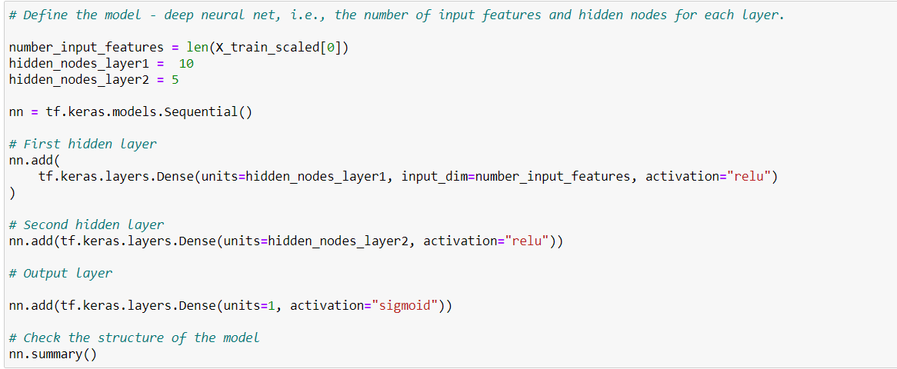
I have used following parameters for the Neural Network as shown in the above code snippet:

    * Number of Neurons: Number of Neurons in Hidden Layer 1 &2 are 10 and 5 respectively 
    * Number of Layers:   There is one Input layer, 2 Hidden  Layers and one output layer
    * Activation Functions: "relu" for hidden layers and "sigmoid" for output layer

Relu function has been used due to its simplyfying output and it is ideal for looking at positive nonlinear input data for classification.
There are two hidden layers which is an attempt to get higher accuracy.

### **Target Model Performance**

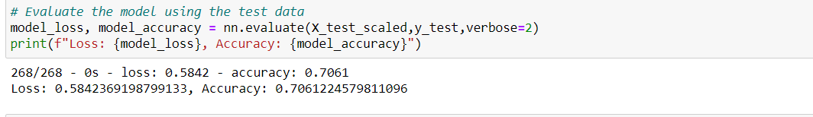

The model accuracy is 70% and was not able to achieve target of 75%.

### **Steps Taken To Improve Performance**

I have taken following steps to improve the performance.

### **Attempt 1** 

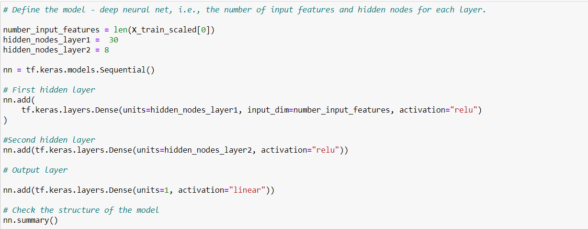
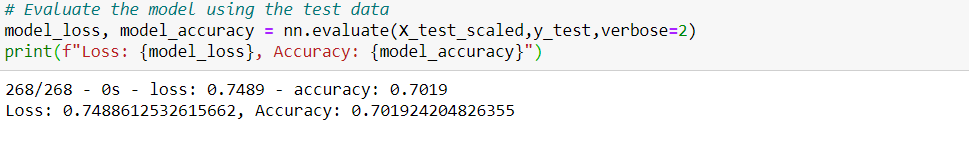

As shown in the above code snippet, following changes were made in the original model:

        Number of Neurons in Hidden layers (30,8)
        Output layer Activation: Linear
        Accuracy  70.2%

### **Attempt 2**

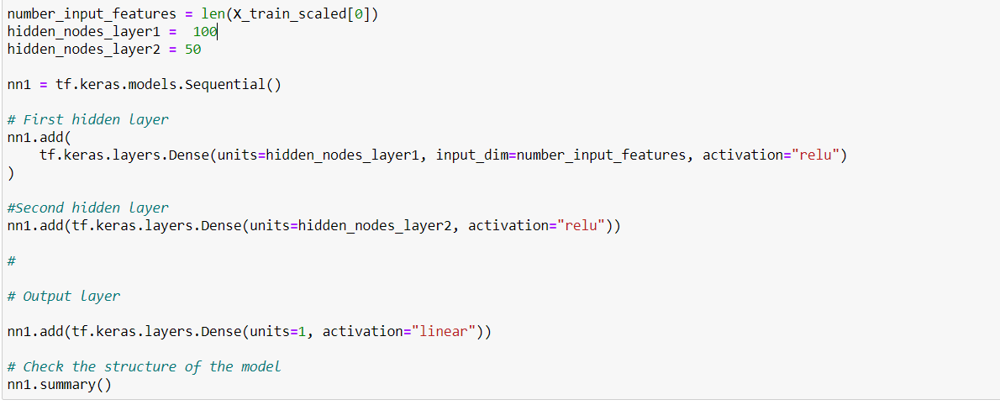
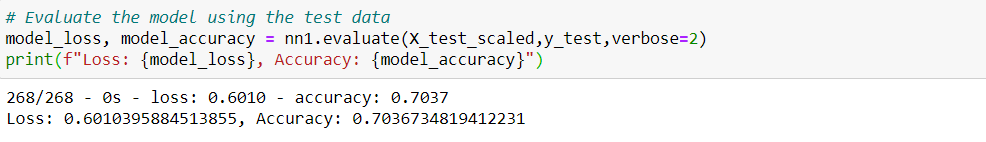

Here following changes were made:

        Number of Neurons in Hidden layers (100,50)
        Accuracy 70.4%

### **Attempt 3**

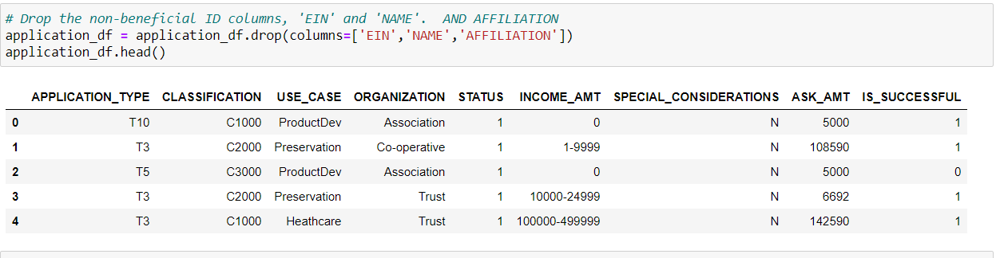
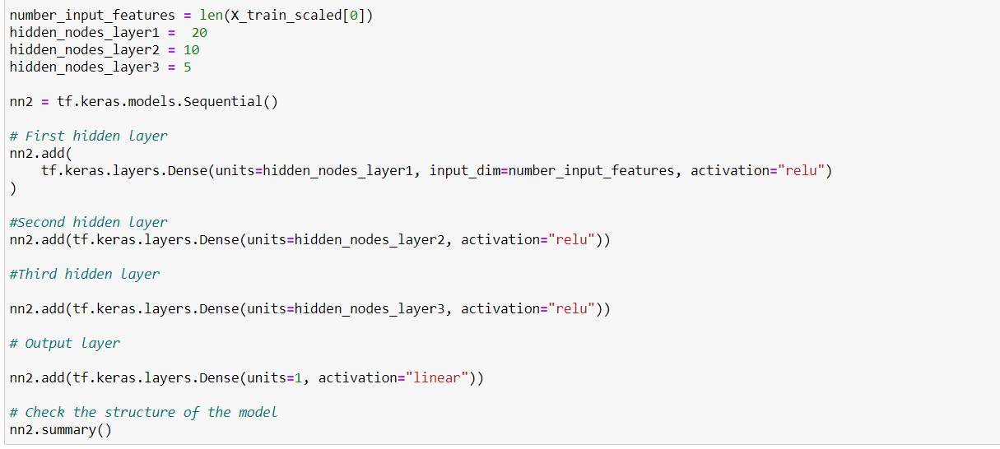
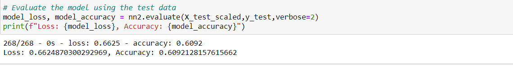

Here following changes were made:

        One Additional Feature dropped (AFFILIATION)
        One additional hidden layer added (20,10,5)
        Accuracy 61%

### **Attempt 4**

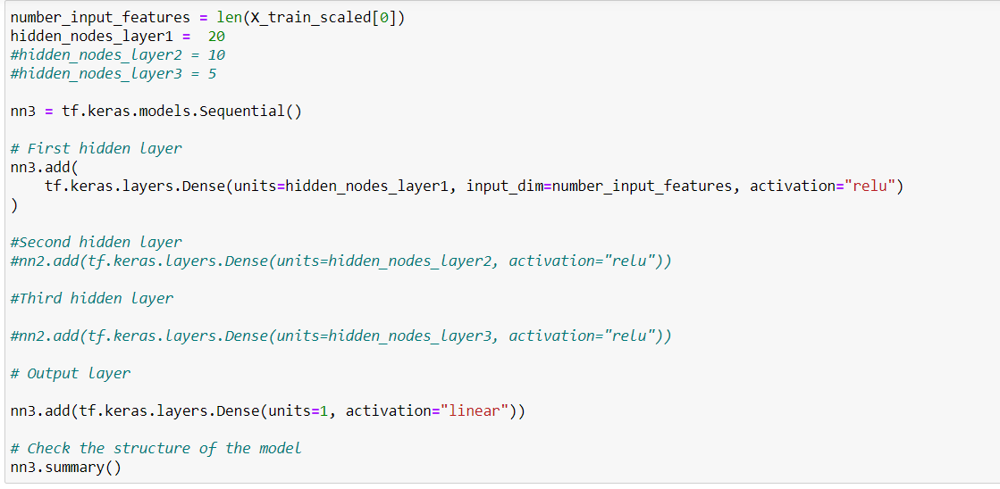
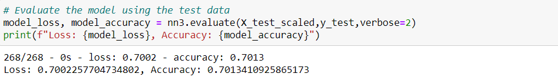

Here following changes were made:

        Originally dropped Feature only (EIN, NAME)
        Only one hidden layer added (20)
        Accuracy 70%

## **SUMMARY**

As explained above, different measures have been taken to improve the accuracy from 70% which included changing the noisy variable, increasing/decsreasing the neaurons, adding additional hidden layers, keeping only one hidden layer, changing the output layer activation function but the accuracy was not increasing from 70%. 

In our original dataset, there are about 34000 data points which is on a lower side from deep learning neuron model point of view hence I would recommend to use "Random Forest" which is faster and is more appropriate for this size of a dataset.

